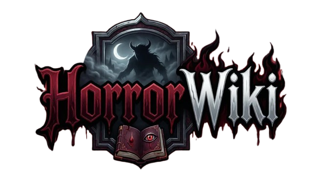

  

  <strong>A enciclopédia sombria para histórias sobrenaturais, fanfics de terror e relatos macabros.</strong>

<h2>🌙 Sobre o Projeto</h2>

  O <strong>HorrorWiki</strong> é uma plataforma web desenvolvida para reunir em um só lugar:

<ul>
  <li>📖 histórias de terror</li>
  <li>👻 relatos sobrenaturais</li>
  <li>🩸 fanfics macabras</li>
  <li>🕯️ lendas urbanas</li>
  <li>💬 fórum de teorias e discussões</li>
  <li>📚 wiki de criaturas, locais e universos de horror</li>
</ul>

  O objetivo é criar uma experiência inspirada em grandes portais de comunidade e conteúdo, como a Fandom,
  porém totalmente voltada ao universo do <strong>terror, suspense e horror psicológico</strong>.

<h2>🛠️ Tecnologias Utilizadas</h2>

<ul>
  <li>Laravel</li>
  <li>PHP 8.5</li>
  <li>Tailwind CSS</li>
  <li>MySQL</li>
  <li>Docker</li>
</ul>

<h2>🎨 Front-end</h2>

A interface foi desenvolvida com foco em:

<ul>
  <li>visual sombrio</li>
  <li>atmosfera macabra</li>
  <li>identidade premium</li>
  <li>design inspirado em portais wiki</li>
  <li>experiência imersiva</li>
</ul>

<h2>🚀 Funcionalidades Planejadas</h2>

<ul>
  <li>✅ Landing page inicial</li>
  <li>✅ Sistema de autenticação</li>
  <li>✅ Cadastro e login de usuários</li>
  <li>✅ Publicação de fanfics</li>
  <li>✅ Sistema de capítulos</li>
  <li>⬜ Fórum de discussões</li>
  <li>⬜ Wiki de criaturas</li>
  <li>⬜ Comentários e avaliações</li>
  <li>⬜ Perfis de autores</li>
  <li>⬜ Sistema de favoritos</li>
  <li>⬜ Painel administrativo</li>
</ul>

<h2>📌 Versionamento</h2>

<h3>Versão 1.0.0</h3>
<blockquote>
  <strong>Commit 001:</strong> Desenvolvimento da Landing Page Inicial
</blockquote>

<blockquote>
  <strong>Commit 002:</strong> Páginas de Cadastro e Login feitas. Lógica de cadastro realizada.
</blockquote>

<blockquote>
  <strong>Commit 003:</strong> Confecção da lógica de login, criação e edição de perfis. Insert de nova tabela para manipular biografias, usuários com perfil completo e desativados.
</blockquote>

<blockquote>
  <strong>Commit 004:</strong> Implementação completa da página de perfil com foto.
</blockquote>

<blockquote>
  <strong>Commit 005:</strong> Publicação de histórias e fanfics. Corrigir texto vazando em fanfics.
</blockquote>

<blockquote>
  <strong>Commit 006:</strong> Correção da falta de quebra de texto das fanfics.
</blockquote>

<blockquote>
  <strong>Commit 007:</strong> Inserção de divisões das páginas de categorias.
</blockquote>

<blockquote>
  <strong>Commit 008:</strong> Inserção de fotos aterrorizantes em cada categoria.
</blockquote>

<h2>🩸 Objetivo do Projeto</h2>

  O HorrorWiki nasce como um projeto para a comunidade apaixonada por:

<ul>
  <li>creepypastas</li>
  <li>horror stories</li>
  <li>terror psicológico</li>
  <li>fanfics</li>
  <li>lendas urbanas</li>
  <li>universos sobrenaturais</li>
</ul>

<h2>📅 Status</h2>

  🚧 Projeto em desenvolvimento 
  🧪 Em fase de testes e melhorias

<h2>👨‍💻 Desenvolvedor</h2>

  Projeto idealizado e desenvolvido por <strong>Kaio Andrião Dalfior</strong>.

<h2>📜 Licença</h2>

  Este projeto está sob licença .
    

        Kaio Andrião Dalfior - CEO J&K Sistemas - TODOS OS DIREITOS RESERVADOS &copy - 2026
    

